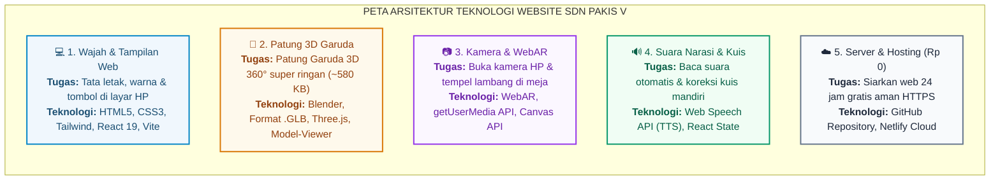
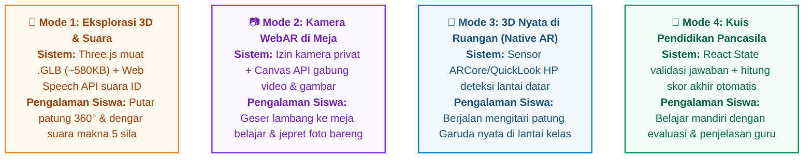

# 📘 BUKU PANDUAN LENGKAP PROYEK
# WEBSITE & MEDIA PEMBELAJARAN WEBAR GARUDA PANCASILA
### SDN Pakis V/372 Surabaya

---

## DAFTAR ISI
1. **Ringkasan Proyek & Tujuan Pembuatan Media**
2. **Daftar Lengkap Teknologi: Definisi Formal, Analogi & Fungsi di Web**
3. **Alur Kronologis Pembuatan: Apa Dulu yang Dibangun, Lalu Kelanjutannya Bagaimana?**
4. **Cara Kerja Teknis Setiap Fitur AR (Di Balik Layar)**
5. **Panduan Lengkap Penggunaan Fitur AR (Untuk Guru & Siswa di Kelas)**
6. **Tanya-Jawab Teknis, Pemecahan Masalah (Troubleshooting) & Biaya Perawatan**

---

## 1. Ringkasan Proyek & Tujuan Pembuatan Media

### Apa Sebenarnya Proyek Ini?
Proyek ini adalah pembuatan **Website Resmi Profil SDN Pakis V Surabaya** yang di dalamnya diintegrasikan sebuah modul inovasi khusus berupa **Media Pembelajaran Interaktif Berbasis WebAR (Web Augmented Reality)** dengan materi **Simbol & Lambang Negara Garuda Pancasila**.

### Mengapa Media Ini Dibuat?
- **Masalah Pembelajaran Tradisional:** Pembelajaran materi simbol dan lambang negara di Sekolah Dasar umumnya mengandalkan media cetak 2 dimensi (2D) di buku paket atau poster dinding kelas yang bersifat statis dan pasif.
- **Karakteristik Siswa SD (Tahap Operasional Konkret):** Menurut teori perkembangan kognitif Jean Piaget, siswa usia sekolah dasar (7–12 tahun) berada pada tahap *operasional konkret*. Mereka membutuhkan representasi visual yang nyata dan interaktif agar materi lambang negara tidak abstrak dan lebih mudah dipahami.
- **Solusi yang Dihadirkan:** Website ini menghadirkan patung digital 3D Garuda Pancasila yang dapat diputar 360 derajat, dilengkapi pembaca suara narasi otomatis, serta dapat dimunculkan langsung ke dunia nyata (di atas meja belajar atau lantai kelas) menggunakan kamera HP/laptop siswa melalui teknologi Augmented Reality (AR) tanpa perlu mengunduh aplikasi dari PlayStore/AppStore.

---

## 2. Daftar Lengkap Teknologi: Definisi Formal, Analogi & Fungsi di Web

Setiap teknologi di bawah ini disusun dengan struktur standar:
1. **Definisi:** Pengertian formal, teknis baku, dan to the point.
2. **Analogi:** Perumpamaan sederhana kehidupan sehari-hari agar mudah dibayangkan.
3. **Fungsi di Website Ini:** Tugas konkret teknologi tersebut pada website SDN Pakis V.

### 🗺️ Peta Visual Arsitektur Teknologi Proyek

| Bagian Sistem | Apa Tugasnya? (Bahasa Mudah) | Teknologi yang Digunakan |
|---|---|---|
| **1. Wajah & Tampilan Web** | Mengatur apa yang dilihat dan disentuh siswa di layar HP (teks, tata letak, warna sekolah, dan tombol). | HTML5, CSS3, Tailwind CSS, JavaScript, React 19, Vite |
| **2. Patung 3D Garuda** | Membuat patung Garuda bervolume 3D nyata (bisa diputar 360°) dengan ukuran sangat ringan (~580 KB). | Blender, Format .GLB (glTF 2.0), Three.js, Google Model-Viewer |
| **3. Kamera & WebAR** | Menyalakan kamera HP siswa dan menempelkan lambang Garuda di meja belajar tanpa install aplikasi. | WebAR, WebRTC (getUserMedia API), HTML5 Canvas API |
| **4. Suara Narasi & Kuis** | Mengubah teks materi menjadi suara wanita Indonesia ramah anak dan menghitung nilai kuis secara instan. | Web Speech API (Text-to-Speech), React State Management |
| **5. Server & Hosting (Rp 0)** | Menyiarkan website selama 24 jam gratis ke seluruh dunia dengan keamanan gembok hijau (HTTPS). | Node.js, Git, GitHub Repository, Netlify Cloud Hosting |

---

### A. Teknologi Tampilan Website (Frontend)

#### 1. Website (Aplikasi Berbasis Web)
- **Definisi:** Sistem informasi atau aplikasi digital yang diakses melalui jaringan internet menggunakan peramban web (*web browser*) dengan protokol HTTP/HTTPS tanpa memerlukan proses instalasi berkas pada media penyimpanan perangkat pengguna.
- **Analogi:** Seperti membaca surat kabar atau ensiklopedia daring; cukup dengan membuka alamat situsnya, seluruh isi informasi langsung tersaji tanpa perlu memasang aplikasi ke memori ponsel.
- **Fungsi di Website Ini:** Siswa, guru, dan wali murid dapat langsung menggunakan media pembelajaran ini cukup dengan mengakses tautan URL atau memindai Kode QR tanpa dibebani keharusan mengunduh aplikasi sebesar ratusan megabyte dari PlayStore.

#### 2. HTML5 (Hypertext Markup Language versi 5)
- **Definisi:** Bahasa markah standar industri yang digunakan untuk menyusun kerangka, hierarki struktural, dan konten dasar pada halaman web (seperti penataan teks, gambar, video, tombol, dan formulir).
- **Analogi:** Seperti kerangka tulang pada tubuh manusia, atau pondasi tiang cor dan susunan bata pada bangunan gedung.
- **Fungsi di Website Ini:** Membentuk susunan struktur halaman, mulai dari penempatan judul teks, paragraf profil sekolah, deretan foto guru, wadah video kamera, hingga kanvas area penampil model 3D.

#### 3. CSS3 & Tailwind CSS (Cascading Style Sheets)
- **Definisi:** CSS adalah bahasa lembar gaya (*stylesheet language*) yang digunakan untuk mengatur tampilan visual, format warna, tipografi, dan tata letak elemen pada halaman web yang ditulis dengan HTML. *Tailwind CSS* adalah kerangka kerja (*framework*) CSS berbasis kelas utilitas (*utility-first*) yang menyediakan pustaka aturan desain siap pakai untuk mempercepat pembuatan antarmuka modern yang responsif.
- **Analogi:** Jika HTML adalah dinding bata polos, maka CSS adalah cat warna, keramik lantai, lampu dekorasi, dan penataan perabot ruangan agar indah dipandang.
- **Fungsi di Website Ini:** Menerapkan warna identitas sekolah (Biru Resmi dan Kuning Emas), memastikan ukuran huruf mudah dibaca anak SD, mengatur efek transisi animasi, serta memastikan tampilan web otomatis menyesuaikan ukuran layar (*responsif*) baik di layar HP, tablet, maupun proyektor laptop.

#### 4. JavaScript (JS ES6+)
- **Definisi:** Bahasa pemrograman tingkat tinggi dan dinamis yang dieksekusi di sisi peramban (*client-side*) untuk menciptakan interaktivitas antarmuka, memproses logika data secara asinkron, dan merespons tindakan (*event*) pengguna secara langsung.
- **Analogi:** Seperti sistem saraf dan jaringan otot yang membuat tubuh dapat bergerak, berpikir, dan bereaksi terhadap stimulus dari luar.
- **Fungsi di Website Ini:** Mengatur seluruh interaktivitas sistem—seperti menghitung perolehan skor kuis, mengaktifkan akses kamera, memicu suara narasi audio, serta merespons sentuhan jari siswa saat memutar objek 3D dan menggeser lambang di layar.

#### 5. React 19
- **Definisi:** Pustaka (*library*) JavaScript berbasis sumber terbuka (*open-source*) yang dikembangkan oleh Meta (Facebook) untuk membangun antarmuka pengguna (*User Interface*) berbasis komponen modular yang reaktif terhadap perubahan data.
- **Analogi:** Seperti teknik menyusun balok mainan Lego; setiap balok memiliki fungsinya tersendiri dan dapat dirakit, dibongkar, atau diperbaiki secara mandiri tanpa merusak konstruksi balok di sebelahnya.
- **Fungsi di Website Ini:** Memecah website menjadi komponen-komponen mandiri (komponen Profil, Berita, Eksplorasi 3D, Kamera AR, dan Kuis). Hal ini membuat website sangat stabil dan memudahkan pengembang ketika ingin memperbarui konten tanpa mengganggu bagian halaman lain.

#### 6. Vite
- **Definisi:** Alat bantu pengembangan (*build tool & bundler*) web generasi baru yang mengompilasi dan mengemas kode program dengan arsitektur modul ES asli (*native ES modules*), menghasilkan waktu muat server lokal dan berkas produksi akhir yang sangat cepat dan efisien.
- **Analogi:** Seperti mesin pengemas dan pengepres otomatis di pabrik modern yang merapikan ribuan barang produksi menjadi paket kecil yang ringkas dan siap didistribusikan dalam hitungan detik.
- **Fungsi di Website Ini:** Mengompresi ribuan baris kode program dan aset grafis website agar dapat dimuat dalam hitungan milidetik saat diakses oleh siswa menggunakan koneksi internet sekolah.

#### 7. Lucide React (Pustaka Ikon Vektor)
- **Definisi:** Pustaka komponen ikonografi vektor digital berbasis SVG (*Scalable Vector Graphics*) yang dirancang secara minimalis dan konsisten untuk kebutuhan antarmuka web modern.
- **Analogi:** Seperti rambu-rambu visual lalu lintas yang memandu pengguna memahami arti suatu fungsi tanpa harus membaca petunjuk teks yang panjang.
- **Fungsi di Website Ini:** Menyediakan simbol visual yang ramah anak pada setiap tombol penting, seperti ikon kamera foto, pengeras suara, tombol rotasi 360°, tanda centang benar pada kuis, serta tanda panah navigasi.

---

### B. Teknologi Pembuatan & Penampil 3D

#### 1. Software Pemodelan 3D (Blender / 3D Modeling Tools)
- **Definisi:** Perangkat lunak aplikasi grafis komputer tiga dimensi yang digunakan untuk merancang, memahat geometri (*modeling*), memetakan tekstur (*texturing*), dan mengatur pencahayaan (*rendering*) objek visual digital.
- **Analogi:** Seperti studio seni pemahat patung; tempat seniman membentuk patung dari tanah liat digital, mengukir lekukan sayap, dan mengoleskan cat warna emas hingga selesai.
- **Fungsi di Website Ini:** Digunakan untuk memahat dan menyusun detail visual patung burung Garuda Pancasila—mencakup helai bulu sayap, ekor, cakar pita Bhinneka Tunggal Ika, serta perisai 5 sila di dada.

#### 2. Format Berkas `.GLB` (glTF 2.0 / GL Transmission Format)
- **Definisi:** Format berkas biner standar internasional yang dirancang oleh Khronos Group untuk transmisi dan pemuatan aset 3D yang sangat efisien di peramban web dengan mengompresi data geometri (*mesh*), tekstur, dan material ke dalam satu berkas terpadu.
- **Analogi:** Seperti format file MP3 untuk rekaman musik atau MP4 untuk video; format standar yang paling ringkas, praktis, dan dapat dibuka di semua perangkat modern.
- **Fungsi di Website Ini:** Menyimpan seluruh aset visual 3D patung Garuda ke dalam 1 berkas biner berukuran sangat kecil (**hanya ~580 Kilobyte**, di bawah 1 MB) sehingga sangat hemat kuota internet siswa dan tidak membuat HP panas.

#### 3. Three.js
- **Definisi:** Pustaka grafis JavaScript tingkat tinggi yang memanfaatkan antarmuka pemrograman WebGL (*Web Graphics Library*) untuk merender adegan 3D interaktif yang terakselerasi oleh perangkat keras (*hardware-accelerated*) di dalam kanvas peramban web.
- **Analogi:** Seperti sistem tata panggung, lampu sorot, dan kamera bioskop yang bertugas mengatur sudut pandang, pencahayaan, dan bayangan patung agar terlihat nyata di depan penonton.
- **Fungsi di Website Ini:** Menghitung pencahayaan matematis, efek kemilau keemasan, dan proyeksi kamera 3D di layar sehingga patung Garuda dapat diputar 360 derajat secara halus oleh jari siswa.

#### 4. Google `<model-viewer>`
- **Definisi:** Komponen web (*Web Component*) resmi dari Google yang mengimplementasikan standar WebXR untuk menampilkan model 3D di peramban web serta memfasilitasi peluncuran antarmuka Augmented Reality (AR) native pada perangkat bergerak (*mobile devices*).
- **Analogi:** Seperti pintu penghubung resmi antara halaman website dengan sensor kamera dan sensor gerak yang ada di smartphone siswa.
- **Fungsi di Website Ini:** Menghubungkan website dengan sistem AR bawaan ponsel (Google ARCore di Android dan Apple QuickLook di iPhone), memungkinkan patung 3D Garuda diproyeksikan langsung berdiri tegak di lantai atau meja kelas nyata.

---

### C. Teknologi Fitur Kamera & Augmented Reality (WebAR)

#### 1. WebAR (Web Augmented Reality)
- **Definisi:** Teknologi realitas tertambah (*Augmented Reality*) yang disajikan langsung melalui peramban web (*web browser*) menggunakan standar web terbuka tanpa mewajibkan pengguna mengunduh atau memasang aplikasi khusus dari toko aplikasi digital.
- **Analogi:** Seperti efek filter kamera interaktif di media sosial, di mana objek digital ditumpangkan langsung ke atas rekaman video dunia nyata di sekitar kita.
- **Fungsi di Website Ini:** Menghadirkan lambang burung Garuda Pancasila langsung ke lingkungan fisik siswa (di atas meja kelas atau lantai sekolah) sehingga siswa dapat berinteraksi secara visual konkret.

#### 2. WebRTC & API Akses Kamera (`navigator.mediaDevices.getUserMedia`)
- **Definisi:** Spesifikasi antarmuka pemrograman JavaScript standar W3C yang memungkinkan halaman web meminta izin dan mengakses aliran data video (*video stream*) dari sensor perangkat keras kamera secara waktu nyata (*real-time*).
- **Analogi:** Seperti pintu pengawas yang meminta izin resmi kepada pemilik rumah sebelum menyalakan kamera dokumentasi.
- **Fungsi di Website Ini:** Mengaktifkan kamera depan atau belakang HP/laptop saat siswa mengklik tombol *"Nyalakan Kamera AR"*. Aliran video hanya diproses secara lokal di memori HP siswa (tidak ada video yang dikirim ke internet), sehingga 100% aman bagi privasi anak.

#### 3. HTML5 `<canvas>` API (Mesin Pengomposisi Foto)
- **Definisi:** Elemen antarmuka pemrograman web yang menyediakan ruang bidang gambar berbasis piksel bitmap, memungkinkan manipulasi grafis dinamis, perataan gambar (*rendering*), dan ekspor data visual ke format gambar berkas biner.
- **Analogi:** Seperti kertas cetak instan di dalam bilik foto (*photo booth*) yang merekatkan gambar latar belakang kamera dengan stiker lambang Garuda menjadi satu lembar foto cetak.
- **Fungsi di Website Ini:** Menangkap rekaman video kamera ruangan dan menggabungkannya dengan lambang Garuda saat tombol *"Foto Bersama AR"* ditekan, lalu secara otomatis menyimpannya ke dalam bentuk file foto PNG di galeri HP siswa.

---

### D. Fitur Audio, Logika Kuis & Server Cloud

#### 1. Web Speech API (`SpeechSynthesis` / Text-to-Speech)
- **Definisi:** Antarmuka pemrograman standar peramban web yang memfasilitasi sintesis suara (*voice synthesis*), mengonversi teks data digital menjadi aliran audio ucapan manusia secara otomatis menggunakan basis data suara bawaan sistem operasi.
- **Analogi:** Seperti narator buku audio yang membacakan naskah bacaan secara jelas kepada pendengar.
- **Fungsi di Website Ini:** Membacakan teks filosofis makna 5 sila dan contoh penerapannya di sekolah menggunakan pelafalan bahasa Indonesia (`id-ID`) berintonasi ramah anak saat tombol speaker diklik, membantu siswa kelas rendah yang belum lancar membaca (gaya belajar auditori).

#### 2. React State Management (`useState`, `useEffect`, `useRef`)
- **Definisi:** Mekanisme internal React untuk mengelola, melacak, dan memperbarui status kondisi data dinamis aplikasi, serta memicu pembaruan rendering visual antarmuka secara otomatis saat terjadi perubahan data.
- **Analogi:** Seperti buku catatan memori otomatis dan papan skor digital yang langsung memperbarui catatan nilai pertandingan tanpa ada data yang terlupakan.
- **Fungsi di Website Ini:** Menyimpan posisi tab yang sedang aktif, melacak koordinat pergeseran (*drag*) lambang Garuda di meja belajar, menghitung jumlah soal yang telah dijawab, serta mengkalkulasi skor akhir kuis secara langsung.

#### 3. Git & GitHub
- **Definisi:** Git adalah sistem pengontrol versi (*Version Control System*) terdistribusi untuk mencatat riwayat perubahan kode sumber. GitHub adalah platform berbasis cloud yang menyediakan layanan penyimpanan repositori Git terpusat serta kolaborasi pengelolaan kode perangkat lunak.
- **Analogi:** Seperti lemari brankas digital dengan fasilitas mesin waktu yang mencatat setiap revisi berkas dokumen secara terperinci sehingga naskah proyek tersimpan aman dan tidak akan hilang.
- **Fungsi di Website Ini:** Menyimpan seluruh kode sumber proyek (`AbdulGhoni109/sdn-pakis-v`) secara aman dan menghubungkannya secara otomatis ke sistem penerbitan cloud.

#### 4. Netlify Cloud Hosting & Deployment
- **Definisi:** Platform komputasi awan (*cloud computing platform*) yang menyediakan infrastruktur hosting berbasis jaringan terdistribusi (*Edge Content Delivery Network*), otomatisasi kompilasi kode (*Continuous Deployment*), serta manajemen sertifikat keamanan SSL/TLS untuk aplikasi web modern.
- **Analogi:** Seperti percetakan dan jaringan stasiun pemancar berita yang secara otomatis menyiarkan edisi terbaru majalah ke seluruh cabang perpustakaan di dunia setiap kali ada naskah yang baru selesai ditulis.
- **Fungsi di Website Ini:** Menyiarkan website resmi SDN Pakis V selama 24 jam sehari dengan alamat web berkeamanan sertifikat gembok hijau (**HTTPS**) secara gratis (biaya pemeliharaan Rp 0 selamanya).

---

## 3. Alur Kronologis Pembuatan: Apa Dulu yang Dibangun, Lalu Kelanjutannya Bagaimana?

Berikut adalah alur urutan kerja nyata dari hari pertama perencanaan sampai website terbit secara online:

```mermaid
flowchart LR
    classDef s1 fill:#EBF2F8,stroke:#1B4F72,stroke-width:2px,color:#1B4F72;
    classDef s2 fill:#F0F7FD,stroke:#0284C7,stroke-width:2px,color:#0284C7;
    classDef s3 fill:#FEF9EC,stroke:#D4921A,stroke-width:2px,color:#92400E;
    classDef s4 fill:#FBF7FF,stroke:#7C3AED,stroke-width:2px,color:#6B21A8;
    classDef s5 fill:#F0FDF4,stroke:#059669,stroke-width:2px,color:#065F46;
    classDef s6 fill:#F8FAFC,stroke:#475569,stroke-width:2px,color:#1E293B;

    S1["<b>1. Riset Konten</b><br>Profil & materi 5 sila"]:::s1
    --> S2["<b>2. Fondasi Web</b><br>React + Tailwind"]:::s2
    --> S3["<b>3. Patung 3D</b><br>Garuda .GLB 580KB"]:::s3
    --> S4["<b>4. Rakit 4 Fitur AR</b><br>3D, Kamera, AR, Kuis"]:::s4
    --> S5["<b>5. Uji Coba</b><br>Tes HP Android & iOS"]:::s5
    --> S6["<b>6. Rilis Online</b><br>GitHub & Netlify Rp 0"]:::s6
```

> **💡 Ringkasan Alur Pembuatan:**
> Pembuatan media ini mengikuti 6 tahap nyata dari awal sampai online:
> 1. **Langkah 1 (Riset Konten):** Menyiapkan naskah materi Pancasila Fase B SD dan data profil SDN Pakis V.
> 2. **Langkah 2 (Fondasi Web):** Membangun halaman dan tata letak website sekolah (profil, guru, fasilitas, berita).
> 3. **Langkah 3 (Aset 3D):** Mengolah patung 3D Garuda agar siap ditampilkan di web dalam ukuran sangat kecil (~580 KB).
> 4. **Langkah 4 (Rakit 4 Fitur AR):** Memprogram fitur interaktif kamera, suara narasi otomatis, dan kuis nilai.
> 5. **Langkah 5 (Uji Coba):** Mengetes seluruh fungsi di berbagai jenis HP dan laptop agar tidak ada tombol yang rusak.
> 6. **Langkah 6 (Peluncuran Online):** Mengunggah website ke internet (GitHub & Netlify) agar bisa dibuka siapa saja secara gratis (Rp 0).

---

### Rincian Lengkap Setiap Tahap Pembangunan:

#### Tahap 1: Perencanaan Materi Kurikulum & Profil Sekolah
- **Apa yang dibuat pertama kali?**
  Mengumpulkan seluruh data teks profil resmi SDN Pakis V/372 Surabaya (Visi, Misi, data fasilitas, profil guru, berita sekolah, ekstrakurikuler, dan prestasi).
- **Materi Edukasi:**
  Menyelaraskan materi dengan Kurikulum Merdeka Fase B (Kelas 4 SD) muatan Pendidikan Pancasila. Menulis naskah arti lambang 5 sila, contoh perilaku baik di lingkungan sekolah, makna angka kemerdekaan pada bulu burung Garuda (17-8-1945), serta membuat 4 butir soal evaluasi pemahaman anak.

#### Tahap 2: Pembuatan Fondasi & Struktur Dasar Web
- **Kelanjutannya:** Menginisiasi (*setup*) proyek web di komputer lokal menggunakan **Vite** dan **React 19**.
- Memasang dan mengonfigurasi **Tailwind CSS** untuk standarisasi warna, tata letak, dan jenis font ramah anak (*Plus Jakarta Sans*).
- Membuat struktur direktori proyek yang teratur:
  - `src/components/` : Tempat komponen tombol, kartu informasi, dan modul AR.
  - `src/pages/` : Tempat halaman-halaman web (Beranda, Profil, Media AR, Berita, dll).
  - `src/data/` : Tempat naskah teks sekolah dan bank soal.
  - `public/models/` : Tempat menyimpan file patung 3D `.glb`.
  - `public/images/` : Tempat menyimpan foto sekolah dan logo lambang Garuda.

#### Tahap 3: Pembuatan Halaman Informasi Profil Sekolah
- **Kelanjutannya:** Membangun kerangka dan tampilan profil sekolah terlebih dahulu:
  1. **Navbar (Menu Atas):** Menu navigasi yang responsif dan fleksibel.
  2. **Beranda (Hero Section):** Menampilkan sambutan kepala sekolah dan foto sekolah.
  3. **Profil & Visi Misi:** Menampilkan sejarah sekolah dan komitmen mutu pendidikan.
  4. **Fasilitas & Tenaga Pendidik:** Menampilkan sarana belajar dan profil dewan guru.
  5. **Berita, Prestasi & Ekstrakurikuler:** Menampilkan prestasi siswa dan kegiatan pramuka/ekskul.
  6. **Footer:** Bagian bawah website berisi alamat, kontak, dan tautan resmi sekolah.

#### Tahap 4: Pemodelan & Kompresi Aset Patung 3D Garuda
- **Kelanjutannya:** Sebelum fitur AR bisa diprogram, aset 3D-nya harus disiapkan terlebih dahulu:
  - Menyiapkan objek patung 3D burung Garuda Pancasila dengan tekstur warna emas, perisai merah-putih di dada, dan pita cengkeraman kaki bertuliskan *"Bhinneka Tunggal Ika"*.
  - **Optimasi Ukuran File:** Mengompresi file 3D ke format standar web `.glb` dengan ukuran **~580 KB** agar tidak membebani memori HP siswa saat diakses.
  - Menyiapkan gambar lambang Garuda resolusi tinggi tanpa latar belakang (transparan format PNG dan SVG) untuk digunakan pada fitur kamera AR.

#### Tahap 5: Perancangan Basis Data Edukasi (`pancasilaData.js`)
- **Kelanjutannya:** Seluruh teks materi pembelajaran disimpan ke dalam file data terstruktur (`src/data/pancasilaData.js`):
  - *Data 5 Sila:* Lambang bintang, rantai, beringin, banteng, padi-kapas; bunyi sila, makna perisai, contoh perilaku konkret di sekolah, dan kalimat narasi suara.
  - *Data Anatomi Bulu:* 17 bulu sayap, 8 bulu ekor, 19 bulu pangkal ekor, 45 bulu leher (tanggal proklamasi 17 Agustus 1945).
  - *Data Kuis:* 4 butir soal pilihan ganda, kunci jawaban, dan kotak penjelasan guru.

#### Tahap 6: Pemrograman 4 Modul Fitur Pembelajaran Media AR
- **Kelanjutannya:** Merakit halaman utama `MediaAR.jsx` beserta 4 komponen sub-fiturnya:
  1. **Membangun Mode 1 (ThreeDExplorer.jsx):**
     Menampilkan patung 3D Garuda di layar yang bisa diputar 360 derajat. Menghubungkannya dengan tombol 5 sila dan tombol anatomi bulu. Memasang **Web Speech API** agar saat tombol speaker ditekan, suara narasi otomatis membacakan materi dalam bahasa Indonesia.
  2. **Membangun Mode 2 (WebcamARViewer.jsx):**
     Membangun fitur kamera interaktif:
     - Menulis kode permintaan izin kamera ke browser (`getUserMedia`).
     - Menampilkan video kamera langsung di layar.
     - Meletakkan gambar transparan lambang Garuda di atas rekaman video.
     - Membuat fungsi sentuh/geser (*drag and drop*) sehingga siswa bisa menggeser lambang Garuda ke meja belajarnya.
     - Menambahkan slider pengatur ukuran (skala), slider putaran (rotasi), dan efek pendaran cahaya emas (*glow*).
     - Menambahkan tombol "Foto Bersama AR" yang menggunakan Canvas API untuk menggabungkan video dan lambang Garuda menjadi foto PNG yang langsung tersimpan di galeri HP.
  3. **Membangun Mode 3 (NativeModelViewer.jsx):**
     Memasang komponen `<model-viewer>` Google. Mode ini mendeteksi permukaan lantai atau meja kelas melalui sensor AR smartphone (Google ARCore di Android / QuickLook di iPhone), sehingga patung Garuda 3D dapat berdiri tegak di lantai kelas secara nyata. Dilengkapi fitur Kode QR agar siswa di depan laptop guru bisa langsung scan dan membuka mode ini di HP mereka.
  4. **Membangun Mode 4 (PancasilaQuiz.jsx):**
     Membangun kuis pilihan ganda 4 soal interaktif. Dilengkapi umpan balik instan (tombol hijau jika benar, merah jika salah), kotak pembahasan guru, indikator progres, kartu skor akhir (0–100), dan tombol pengulangan kuis.

#### Tahap 7: Integrasi Modul AR ke Navigasi Website Utama
- **Kelanjutannya:** Memasukkan komponen `<MediaAR />` ke dalam file induk `App.jsx`, diletakkan secara strategis di antara seksi Profil Sekolah dan seksi Berita.
- Menambahkan tautan "Media AR" ke menu navigasi Navbar dan Footer sehingga siswa maupun guru dapat mengaksesnya dalam sekali klik dari halaman mana pun.

#### Tahap 8: Pengujian di Berbagai Perangkat (Testing & Perbaikan Tampilan)
- **Kelanjutannya:** Diuji pada layar komputer/laptop menggunakan browser Google Chrome, Safari, dan Microsoft Edge.
- Diuji langsung pada berbagai smartphone Android dan iPhone:
  - Memastikan kamera belakang langsung menyala dengan lancar.
  - Memperbaiki kontras warna tombol: misalnya tombol *"Nyalakan Kamera AR"* diubah menjadi warna emas solid dengan teks hitam pekat agar tidak menyatu dengan warna latar belakang.
  - Memastikan respon sentuhan jari saat memutar 3D dan menggeser lambang di layar sentuh HP terasa mulus dan tidak lambat.

#### Tahap 9: Peluncuran ke Internet (Deployment ke GitHub & Netlify)
- **Kelanjutannya (Tahap Terakhir):** Seluruh file proyek dikirim ke repositori GitHub (`AbdulGhoni109/sdn-pakis-v`).
- Server cloud Netlify dihubungkan langsung ke repositori GitHub tersebut.
- Setiap kali ada berkas baru atau perbaikan, Netlify secara otomatis merakit ulang proyek dalam hitungan detik dan menyiarkannya ke alamat web resmi berkeamanan HTTPS yang bisa dibuka gratis oleh siswa kapan pun dari rumah.

---

## 4. Cara Kerja Teknis Setiap Fitur AR (Di Balik Layar)

| Mode Belajar | Cara Kerja di Balik Layar (Sistem) | Pengalaman Nyata yang Dirasakan Siswa |
|---|---|---|
| **Mode 1: Eksplorasi 3D & Suara** | Three.js memuat berkas patung `.glb` (~580 KB) dan merender 3D. Tombol audio memanggil Web Speech API bawaan peramban. | Siswa memutar patung Garuda 360° dan mendengarkan suara narasi penjelasan makna tiap sila secara otomatis. |
| **Mode 2: Kamera WebAR di Meja** | Peramban meminta izin kamera secara privat. Canvas API menggabungkan tangkapan video dan gambar lambang menjadi satu foto. | Siswa melihat lambang Garuda melayang di meja belajar, bisa digeser-geser, diperbesar, dan difoto ke galeri HP. |
| **Mode 3: 3D Nyata di Ruangan** | Google Model-Viewer mengaktifkan sensor AR ponsel (ARCore/QuickLook) untuk memindai permukaan lantai/meja kelas yang datar. | Patung Garuda 3D berdiri tegak di lantai ruang kelas secara nyata dan siswa bisa berjalan mengelilinginya. |
| **Mode 4: Kuis Pancasila** | Memori React State memeriksa kecocokan jawaban pilihan ganda secara otomatis dan menghitung skor akhir (0–100). | Siswa mendapat umpan balik benar/salah secara instan lengkap dengan kotak pembahasan penjelasan dari guru. |

---

## 5. Panduan Lengkap Penggunaan Fitur AR (Untuk Guru & Siswa di Kelas)

Berikut adalah panduan operasional langkah demi langkah saat memanfaatkan menu **Media AR** dalam kegiatan belajar-mengajar di kelas:

### Mode 1: Eksplorasi 3D & Suara
- **Tujuan Pembelajaran:** Mengamati bentuk fisik lambang negara secara menyeluruh dari segala sisi dan mendengarkan penjelasan audio.
- **Langkah Penggunaan:**
  1. Klik tab **"Eksplorasi 3D & Suara"**.
  2. Sentuh dan geser patung Garuda di layar untuk memutarnya 360 derajat. Gunakan dua jari untuk memperbesar (*zoom in*).
  3. Klik salah satu dari 5 lambang sila di bagian bawah layar (Bintang, Rantai, Beringin, Banteng, Padi & Kapas).
  4. Baca makna lambang dan contoh pengamalannya di lingkungan sekolah.
  5. Tekan tombol speaker **"Dengarkan Narasi Suara"** agar website membacakan penjelasan materi dengan suara ramah anak secara otomatis.
  6. Klik tab **"Anatomi 17-8-1945"** untuk mempelajari rahasia jumlah bulu kemerdekaan pada sayap, ekor, dan leher burung Garuda.

---

### Mode 2: Kamera WebAR Interaktif
- **Tujuan Pembelajaran:** Menghadirkan lambang Garuda tepat di atas meja belajar siswa menggunakan kamera dan mengambil foto hasil karya belajar.
- **Langkah Penggunaan:**
  1. Klik tab **"Kamera WebAR Interaktif"**.
  2. Tekan tombol emas besar: **"Nyalakan Kamera AR"**.
  3. Ketika browser memunculkan pertanyaan izin: *"Izinkan website mengakses kamera Anda?"*, pilih **"Izinkan" (Allow)**.
  4. Arahkan kamera HP ke meja belajar atau lantai ruang kelas.
  5. Lambang Garuda akan muncul melayang di atas rekaman kamera:
     - **Geser Posisi:** Sentuh dan tahan lambang Garuda, lalu geser ke titik meja yang diinginkan.
     - **Atur Ukuran:** Geser slider *"Ukuran Lambang"* untuk membesarkan atau mengecilkan.
     - **Atur Sudut:** Geser slider *"Rotasi Derajat"* untuk memutar kemiringan lambang.
     - **Efek Cahaya:** Beri centang pada opsi *"Efek Cahaya Emas"* agar lambang berpendar cerah.
  6. Tekan tombol hijau **"Foto Bersama AR"**: Foto di layar akan langsung dijepret dan diunduh otomatis ke galeri HP siswa sebagai portofolio belajar.
  7. *Catatan:* Jika perangkat tidak memiliki kamera (misal di lab komputer lama), siswa dapat menekan tombol **"Gunakan Simulasi Meja"** untuk tetap belajar menggunakan meja virtual.

---

### Mode 3: 3D Nyata di Ruangan (Native AR HP)
- **Tujuan Pembelajaran:** Memproyeksikan patung 3D Garuda berdimensi nyata berdiri di lantai kelas menggunakan sensor Augmented Reality smartphone modern.
- **Langkah Penggunaan:**
  1. Buka website di HP. Jika guru sedang menampilkan web di layar laptop kelas, siswa cukup mengarahkan kamera HP ke **Kode QR** yang ada di layar untuk langsung membuka halaman di HP mereka.
  2. Klik tab **"3D Nyata di Ruangan"**.
  3. Tekan tombol emas: **"📱 Tampilkan AR di Ruangan Nyata"**.
  4. Kamera HP akan membuka mode AR:
     - Arahkan kamera HP ke lantai atau meja kelas yang datar dan berpenerangan cukup.
     - Gerakkan HP perlahan memutar agar sensor smartphone mengenali permukaan meja/lantai.
     - Patung 3D Garuda berukuran nyata akan muncul berdiri tegak di atas meja atau lantai kelas!
     - Siswa dapat berjalan mendekat atau mengitari patung dari sisi depan, samping, dan belakang seolah-olah patung tersebut ada di hadapan mereka.

---

### Mode 4: Kuis Pendidikan Pancasila
- **Tujuan Pembelajaran:** Melakukan evaluasi pemahaman mandiri setelah mengeksplorasi materi.
- **Langkah Penggunaan:**
  1. Klik tab **"Kuis Pendidikan Pancasila"**.
  2. Baca pertanyaan soal dan pilih salah satu pilihan jawaban (A, B, C, atau D).
  3. Sistem langsung memberi respons detik itu juga: tombol hijau jika benar atau merah jika salah, disertai **Kotak Penjelasan Guru** yang menerangkan alasan materi tersebut.
  4. Klik tombol **"Lanjut ke Soal Berikutnya"** hingga soal nomor 4 selesai.
  5. Kartu hasil belajar akan tampil memuat skor akhir (skala 0–100), jumlah jawaban benar, serta tombol **"Ulangi Kuis"** jika siswa ingin mencoba kembali.

---

## 6. Tanya-Jawab Teknis, Pemecahan Masalah (Troubleshooting) & Biaya Perawatan

### 1. Bagaimana jika kamera HP tidak mau menyala saat tombol diklik?
- **Penyebab:** Pengguna biasanya tidak sengaja menekan tombol "Blokir" (*Block*) saat browser meminta izin kamera, atau izin kamera pada aplikasi Google Chrome di pengaturan HP belum aktif.
- **Solusi Langkah demi Langkah:**
  1. Pada aplikasi browser Google Chrome di HP, perhatikan bilah alamat web (URL) di bagian atas.
  2. Klik ikon pengaturan atau gembok di sebelah kiri alamat web.
  3. Pilih menu **"Izin" (Permissions) -> "Kamera" (Camera)**, lalu ubah pilihannya menjadi **"Izinkan" (Allow)**.
  4. Muat ulang (*refresh*) halaman web, lalu tekan kembali tombol "Nyalakan Kamera AR".

### 2. Apakah media ini bisa digunakan di HP lama yang tidak memiliki sensor AR canggih?
- **Sangat bisa.** Inilah alasan utama mengapa media ini dirancang dengan 4 mode belajar berbeda:
  - Jika HP siswa belum memiliki sensor AR ruang (Mode 3), siswa tetap dapat belajar dengan lancar menggunakan **Mode 1 (Eksplorasi 3D & Suara)** dan **Mode 2 (Kamera WebAR Interaktif)** yang kompatibel dengan 99% semua jenis smartphone berlayar sentuh.
  - Bahkan jika siswa tidak memegang HP sama sekali di kelas, guru dapat memandu pembelajaran secara klasikal menggunakan 1 buah laptop dan proyektor kelas.

### 3. Apakah website ini menghabiskan banyak kuota internet siswa?
- **Sangat hemat.** Semua aset grafis dan model 3D di website ini telah dikompresi secara maksimal. Patung 3D Garuda hanya berukuran sekitar **~580 KB** (kurang dari 1 MB), jauh lebih kecil dibandingkan membuka 1 foto di aplikasi Instagram (yang rata-rata memakan kuota 2–5 MB). Sekali website dibuka, seluruh halaman akan tersimpan di memori sementara (*cache*) browser sehingga pembukaan berikutnya berjalan instan tanpa menyedot kuota lagi.

### 4. Apakah pihak sekolah harus mengeluarkan biaya langganan bulanan atau tahunan?
- **Sama sekali tidak ada biaya (100% Gratis Seumur Hidup / Rp 0).**
  - Server siar cloud Netlify menggunakan paket gratis selamanya.
  - Repositori kode tersimpan gratis di GitHub.
  - Suara narasi otomatis menggunakan Web Speech API yang sudah ada di dalam sistem operasi HP/laptop pengguna (bukan API berbayar dari pihak luar).
  - Tidak ada biaya perawatan bulanan yang membebani kas sekolah.

---
*Dokumen ini merupakan panduan teknis dan operasional resmi proyek Website & Media Pembelajaran WebAR SDN Pakis V/372 Surabaya.*
